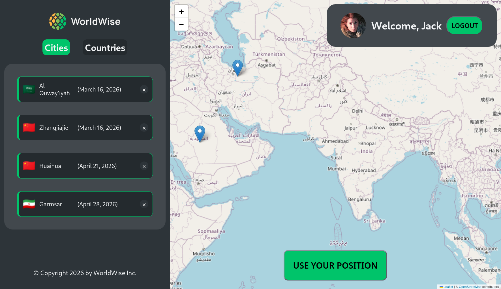
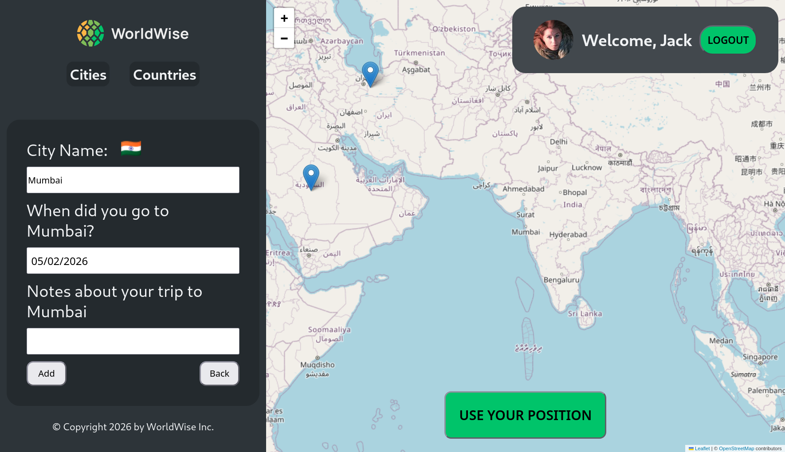
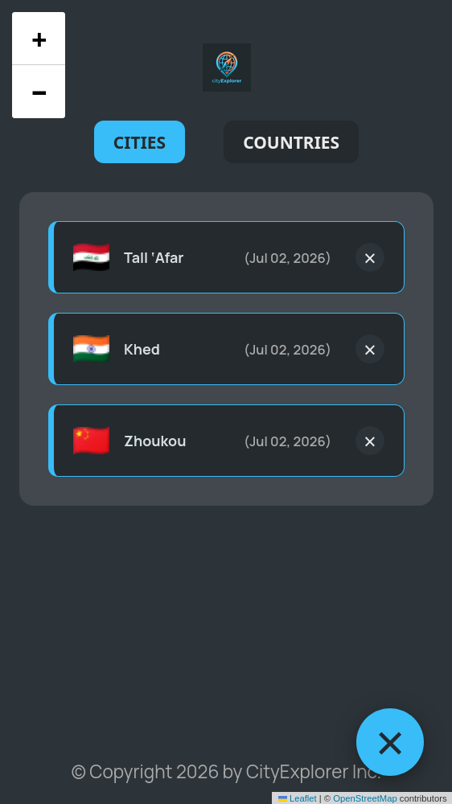
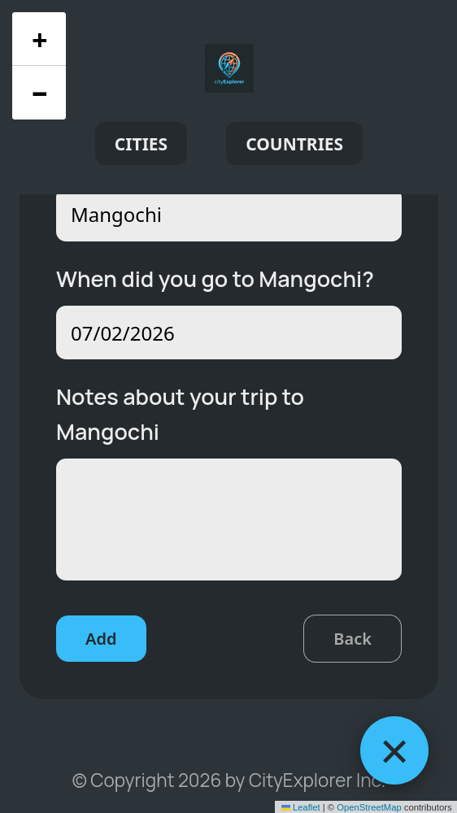

# cityExplorer – Travel Tracking App

A full-stack travel tracking app where users can log cities they've visited on an interactive world map. Built with React + Vite on the frontend and Supabase as the backend.

**Live:** https://cityexplorermss.netlify.app/

---

## Screenshots







---

## Features

- **Interactive map** — click anywhere on the map to drop a marker, fly to that location, and open a form to log the city
- **Reverse geocoding** — clicking the map automatically fetches the city and country name via the BigDataCloud API, no manual typing needed
- **Authentication** — sign up and log in via Supabase Auth; session persists across page refreshes
- **Per-user data isolation** — Supabase Row Level Security ensures each user only ever sees their own cities, enforced at the database level with no extra filtering code in React
- **Current location** — custom `useLocation` hook fetches the user's browser geolocation and flies the map to their position
- **Protected routes** — `ProtectedRoute` component waits for session initialisation before redirecting, preventing premature redirects to login before the auth check completes

---

## Tech Stack

| Layer            | Technology                         |
| ---------------- | ---------------------------------- |
| Frontend         | React 18, Vite                     |
| Routing          | React Router v6                    |
| State Management | Redux Toolkit, createAsyncThunk    |
| Backend & Auth   | Supabase (PostgreSQL + Auth)       |
| Map              | Leaflet, React-Leaflet             |
| Forms            | React Hook Form                    |
| Geocoding        | BigDataCloud Reverse Geocoding API |
| Styling          | CSS Modules                        |

---

## Architecture Decisions

**Why Redux Toolkit over Context API**
All API calls are managed via `createAsyncThunk`, which gives consistent `loading`, `fulfilled`, and `rejected` states across the app without manual try/catch in every component. State is split into focused slices — `authSlice`, `cityListSlice`, `currPositionSlice`, and `logDataSlice` — keeping each concern isolated.

**Why Supabase RLS instead of client-side filtering**
Row Level Security policies are defined at the database level. The database automatically filters rows based on the authenticated user's ID — there is no `if (city.userId === currentUser.id)` logic anywhere in the React code. This is more secure and less error-prone.

**Session persistence and the `AuthInitializer` problem**
A common issue with Supabase + Redux apps is that page refresh logs users out because Redux state resets on reload. The fix is an `AuthInitializer` component that runs once on mount, reads the existing Supabase token from storage, and rehydrates Redux state before any route protection logic runs. Without this, `ProtectedRoute` redirects to login before the session check completes.

---

## Getting Started

### Prerequisites

- Node.js 18+
- A Supabase project (free tier works)

### Environment Variables

Create a `.env` file in the root:

```
VITE_SUPABASE_URL=your_supabase_project_url
VITE_SUPABASE_ANON_KEY=your_supabase_anon_key
```

### Install and Run

```bash
git clone https://github.com/msshaikh1717/udemy-part-3
cd udemy-part-3
npm install
npm run dev
```

The cityExplorer app entry point is `src/WorldWise/AppWorldWise.jsx`. The repo also contains other standalone React practice apps (`AppAtomicBlog`, `AppReactQuiz`, `AppBankAccChallenge`, `AppDateCounter`) built during the same learning period.

### Supabase Setup

1. Create a `cities` table with columns: `id`, `user_id`, `city_name`, `country`, `emoji`, `date`, `notes`, `position` (lat/lng object)
2. Enable Row Level Security on the `cities` table
3. Add an RLS policy: `auth.uid() = user_id` for SELECT, INSERT, UPDATE, DELETE

---

## Project Structure

```
src/
├── app/
│   └── store.js                    # Redux store configuration
├── features/
│   └── worldWise/
│       ├── authSlice.js            # Auth state (login, logout, session)
│       ├── cityListSlice.js        # Cities CRUD via Supabase
│       ├── currPositionSlice.js    # User's current geolocation
│       └── logDataSlice.js         # Logging / activity data
├── hooks/
│   ├── useLocation.js              # Browser geolocation + map fly-to
│   └── useGetCity.js               # Fetch single city details
└── WorldWise/
    ├── AppWorldWise.jsx            # Root component and router setup
    ├── lib/
    │   └── supabaseClient.js       # Supabase client initialisation
    ├── components/
    │   ├── Auth/
    │   │   ├── AuthInitializer.jsx # Rehydrates Redux from Supabase session on load
    │   │   └── ProtectedRoute.jsx  # Waits for isInitialized before redirecting
    │   ├── Map/
    │   │   └── Map.jsx
    │   └── SideBar/
    │       ├── Sidebar.jsx
    │       ├── Tabs.jsx
    │       └── Logo.jsx
    └── pages/
        ├── AppLayout.jsx
        ├── Login.jsx
        ├── Cities.jsx
        ├── CityDetails.jsx
        ├── Countries.jsx
        ├── AddForm.jsx
        └── Homepage.jsx
```

---

## Known Limitations

- Map tiles require an internet connection (Leaflet pulls from OpenStreetMap)
- Reverse geocoding accuracy depends on BigDataCloud's free tier coverage
- No offline support

---

## License

MIT
